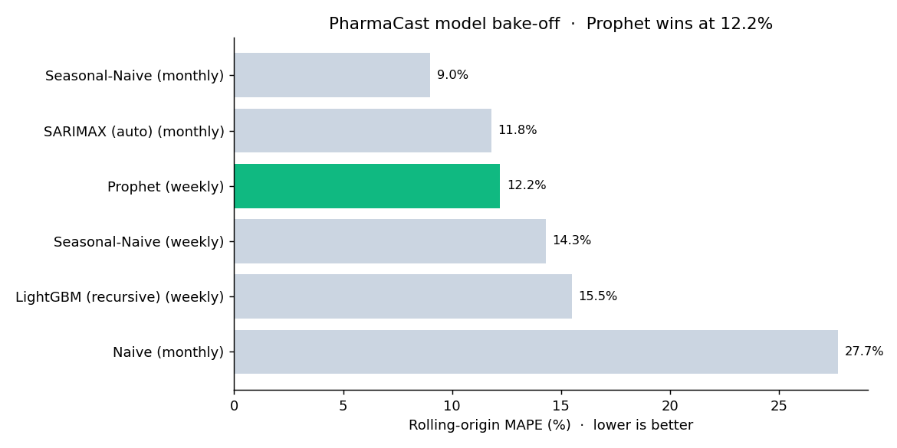

# PharmaCast



This is a side project where I tried to forecast weekly drug demand from point of sale data. I wanted something close to a real inventory problem, and I also wanted to be honest with myself about which models are actually worth the trouble versus which ones just sound fancy.

**Live dashboard:** https://chillchoi.github.io/pharmacast-dashboard/pharmacast_dashboard.html

Short version of what I found: a Prophet model on weekly data got to 12.2% MAPE under proper cross validation, and it was the only learned model that actually beat its own naive baseline. SARIMAX and LightGBM both lost. I think that result is more interesting than if everything had just worked.

## Why I picked this

Pharmacies lose money two ways. Stock out of a fast moving drug and you lose the sale, and for essential meds that is an actual access problem. Over order something slow or temperature sensitive and you pay for storage and waste. Both come down to a demand forecast, so I figured it was a good thing to build end to end.

## The data

Daily point of sale records in salesdaily.csv, Jan 2014 to Oct 2019, 2,106 rows. Eight drug categories by ATC code:

| Code | Category | Share of volume |
|------|----------|-----------------|
| N02BE | Analgesics (anilides, like paracetamol) | ~53% |
| N05B | Anxiolytics | ~16% |
| R03 | Respiratory / anti-asthma | ~10% |
| M01AB | Anti-inflammatory | ~9% |
| M01AE | Anti-rheumatic | ~7% |
| N02BA | Analgesics (salicylic acid) | ~7% |
| R06 | Antihistamines | ~5% |
| N05C | Hypnotics / sedatives | ~1% |

First thing I checked was data quality. 2,106 calendar days, 2,106 rows, no missing dates and no nulls. So no imputation needed, which honestly never happens, so I was happy.

Then I looked at how sparse each category is, and this part ended up mattering:

| Category | Days with zero sales (of 2,106) |
|----------|---------------------------------|
| N05C | 1,430 (68%) |
| R03 | 484 (23%) |
| R06 | 256 (12%) |
| others | < 4% |

N05C basically sells nothing most days. That is intermittent demand, and normal time series models choke on it, so I set it aside to deal with separately instead of forcing it through the same pipeline.

## How I went about it

I treated this like a bake off instead of just picking one model and tuning it forever. Every model had to beat a naive benchmark on the same validation setup, otherwise it is not really earning its spot.

For validation I used rolling origin (walk forward) cross validation instead of one train test split. With only a few years of data, a single holdout is too noisy and a model can look amazing or terrible just based on where the split lands. Rolling origin refits on growing history and scores a bunch of consecutive windows, so the number you get is an average over several real forecasting situations. I report mean MAPE across 6 folds.

Baselines first: naive (carry the last value forward) and seasonal naive (same period one year ago). That is the bar to beat. Seasonal naive is famously hard to beat on seasonal data, so I wanted it in there to keep me honest.

Then the actual models: SARIMAX with auto order from pmdarima, Prophet, and LightGBM with lag, rolling, and calendar features.

## What actually happened

### Monthly: SARIMAX lost to a one liner

I started monthly. STL decomposition gave a seasonal strength of 0.738 which is pretty strong, so a seasonal model should have helped. auto_arima picked SARIMAX(1,0,0)(2,0,1)[12].

| Model | Granularity | Rolling MAPE |
|-------|-------------|--------------|
| Naive | monthly | 27.7% |
| Seasonal Naive | monthly | 9.0% |
| SARIMAX (auto) | monthly | 11.8% |

SARIMAX lost to seasonal naive. Two reasons and noticing them was kind of the whole point. One, I only had 63 monthly training points which is way too few for a seasonal model with that many parameters, and the seasonal terms came back insignificant (p around 0.3 to 0.4). Two, auto_arima went with zero differencing plus an intercept, so it was basically fitting an AR process around a flat mean. When I forced seasonal differencing instead it got worse (20.6% MAPE) with convergence warnings, which is just overfitting on tiny data.

So instead of beating on SARIMAX more, I accepted the real issue: monthly aggregation starved every model of signal.

### Weekly: more data, and a model that wins

Going weekly gives about 300 observations (5x the data) while keeping the yearly seasonality. Reran the bake off:

| Model | Granularity | Rolling MAPE |
|-------|-------------|--------------|
| Seasonal Naive | weekly | 14.3% |
| LightGBM (recursive, engineered features) | weekly | 15.5% |
| Prophet (multiplicative yearly) | weekly | 12.2% |

Prophet beat its baseline by about 2 points and won 5 of 6 folds. LightGBM, which I genuinely expected to win, came in below the naive baseline. With around 300 points and a 12 week recursive forecast, the tree model keeps feeding its own one step errors back in and there is not enough history to learn solid lag interactions. Prophet bakes the seasonality in directly so it falls apart more slowly.

The thing I took away from this: gradient boosting is not an automatic winner. On a small strongly seasonal series a structural model beats it, and the only way to actually know is to benchmark against a baseline.

## Final model

Prophet, refit on the full weekly history, multiplicative yearly seasonality, 80% prediction interval, forecasting 12 weeks out (about a quarter). The forecast and the full leaderboard are wired into the dashboard.

## Intermittent demand: the N05C side quest

N05C (hypnotics/sedatives) is the weird one since it sells nothing on 68% of days. That is textbook intermittent demand, and the usual advice is to use something like Croston's method, which forecasts the demand size and the gap between non zero demands separately. I wanted to test that advice instead of just believing it.

First surprise is that the intermittency depends entirely on granularity:

| Granularity | N05C non-zero periods |
|-------------|-----------------------|
| Daily | 32% (intermittent) |
| Weekly | 88% (basically continuous) |

Aggregating to weekly makes the problem mostly disappear, and at weekly granularity Croston's has nothing to work with, so it lost to a plain mean. So I took it down to the daily series where the zeros actually are, and scored with MASE (mean absolute scaled error) since MAPE goes crazy when actuals are zero. MASE below 1 beats naive, above 1 is worse than naive.

| Method (daily N05C) | MASE |
|---------------------|------|
| Naive (last value) | 0.816 |
| Mean | 0.984 |
| Croston's | 1.059 |

Croston's came last. The reason is that N05C is lumpy but still fairly frequent (non zero roughly 1 day in 3, small counts up to 9), not the sparse spiky spare parts demand Croston's was built for. It just outputs a flat smoothed level around 0.59 a day, and simple persistence beats that over the horizon.

Takeaway I actually like here: a specialized model is not automatically the right move, you have to validate it and pick the right metric to validate with. For N05C the better call is to forecast it weekly as part of the total demand, where Prophet already works fine, instead of building a custom daily model. The granularity choice did more than the model choice, which is the same lesson from the main bake off.

## Repo structure

```
salesdaily.csv               raw daily POS data
PharmaCast.ipynb             analysis: EDA, baselines, SARIMAX, Prophet, LightGBM, diagnostics
pharmacast_forecast.json     exported champion forecast and leaderboard
pharmacast_dashboard.html    interactive dashboard
README.md
```

## Tech

Python, pandas, statsmodels (STL, SARIMAX), pmdarima, Prophet, LightGBM, matplotlib, Chart.js

## Running it

```bash
pip install -r requirements.txt
```

Then open PharmaCast.ipynb and run top to bottom. The dashboard (pharmacast_dashboard.html) is self contained, just open it in a browser. It is also hosted with GitHub Pages at the link up top.

To turn on the live page yourself: repo Settings, then Pages, set Source to the main branch and root folder, save. Give it a minute and the dashboard is live.

## Stuff I might do next

- N05C: the side quest showed Croston's does not beat naive here, so a fuller pass would test SBA and TSB, and score it at the inventory level (fill rate, holding cost) instead of just point error.
- Per category forecasts: the big categories (N02BE, N05B) probably deserve their own Prophet models instead of only forecasting the total.
- Exogenous regressors: flu season or other health signals as Prophet regressors for the respiratory and analgesic categories.
- Check the interval, not just the point forecast: see if the 80% band actually covers 80% of the time.

## Notes

- I used MAPE as the headline metric so models are comparable, and also watched MAE while building.
- All scores are mean rolling origin (walk forward) cross validation, not a single split, which is why some numbers look higher than a lucky one off holdout would. That is on purpose.
- Data runs 2014 to 2019 and the forecast picks up from the last observed week.
